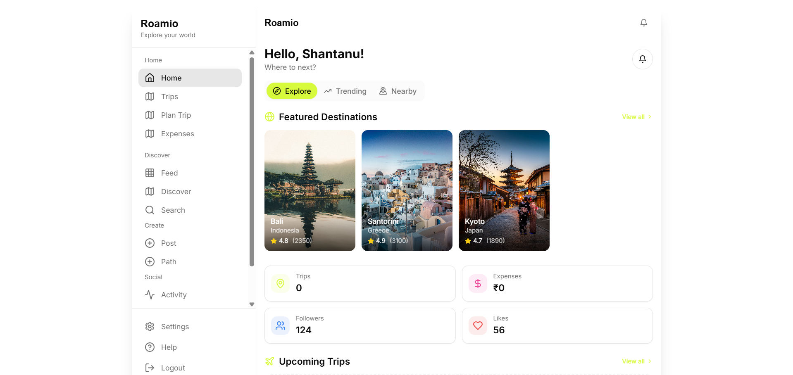

# 🌍 roamio

<div align="center">



**Your ultimate travel companion app for seamless journey planning, sharing, and memories.**

[](https://reactjs.org/)
[](https://www.typescriptlang.org/)
[](https://supabase.io/)
[](https://tailwindcss.com/)
[](https://vitejs.dev/)
[](LICENSE)

</div>

## ✨ Features

### 🧳 Trip Planning & Management
- **Create & Manage Trips**: Plan your adventures with detailed itineraries
- **Collaborative Planning**: Invite friends and family to join your trips
- **Trip Status Tracking**: Keep track of planned, active, completed, or cancelled trips
- **Trip Participants**: Manage who joins your journey with role-based permissions

### 📝 Travel Journal
- **Personal Travel Diary**: Document your experiences with rich text entries
- **Privacy Controls**: Choose between private and public journal entries
- **Social Media Integration**: Cross-post your journal entries to Instagram
- **Media Support**: Add images to enhance your journal entries

### 🗺️ Location Services
- **Nearby Places**: Discover attractions, restaurants, hotels, and more around you
- **Place Details**: Get comprehensive information about places including ratings, reviews, and contact info
- **Place Reviews**: Share your experiences by reviewing places you've visited

### 🌐 Social Features
- **Social Feed**: Browse through posts from other travelers
- **User Profiles**: Customize your profile and view others'
- **Follow System**: Follow other users to see their updates
- **Post Interactions**: Like, comment, and share posts with the community

### 💬 Translation Services
- **Text Translation**: Translate text between multiple languages
- **Voice Translation**: Speak and get instant translations
- **Translation History**: Access your previous translations

### 📱 Mobile-Friendly
- **Responsive Design**: Optimized for both desktop and mobile experiences
- **PWA Support**: Install as a Progressive Web App on your device
- **Capacitor Integration**: Native mobile capabilities for Android

## 🛠️ Technologies

### Frontend
- **React**: UI library for building the user interface
- **TypeScript**: Type-safe JavaScript for robust code
- **Tailwind CSS**: Utility-first CSS framework for styling
- **Shadcn UI**: Component library built on Radix UI
- **Lucide Icons**: Beautiful, consistent icon set
- **React Router**: For application routing
- **React Hook Form**: Form validation and handling
- **React Query**: Data fetching and state management

### Backend & Services
- **Supabase**: Backend-as-a-Service for authentication, database, and storage
- **PostgreSQL**: Relational database (via Supabase)
- **Supabase Functions**: Serverless functions for translation services

### Build Tools
- **Vite**: Next-generation frontend tooling
- **ESLint**: Code linting
- **PostCSS**: CSS processing

## 🚀 Getting Started

### Prerequisites
- Node.js (v16 or higher)
- npm or yarn

### Installation

1. Clone the repository
   ```bash
   git clone https://github.com/yourusername/wander-symphony.git
   cd wander-symphony
   ```

2. Install dependencies
   ```bash
   npm install
   # or
   yarn
   ```

3. Set up environment variables
   Create a `.env` file in the root directory with your Supabase credentials:
   ```
   VITE_SUPABASE_URL=your_supabase_url
   VITE_SUPABASE_ANON_KEY=your_supabase_anon_key
   ```

4. Start the development server
   ```bash
   npm run dev
   # or
   yarn dev
   ```

5. Open your browser and navigate to `http://localhost:5173`

### Building for Production

```bash
npm run build
# or
yarn build
```

## 📱 Mobile Development

Wander Symphony supports mobile development using Capacitor:

```bash
# Add Android platform
npx cap add android

# Sync web code to native project
npx cap sync

# Open Android Studio to build and run
npx cap open android
```

## 🤝 Contributing

Contributions are welcome! Please feel free to submit a Pull Request.

1. Fork the repository
2. Create your feature branch (`git checkout -b feature/amazing-feature`)
3. Commit your changes (`git commit -m 'Add some amazing feature'`)
4. Push to the branch (`git push origin feature/amazing-feature`)
5. Open a Pull Request

## 📄 License

This project is licensed under the MIT License - see the LICENSE file for details.

## 🙏 Acknowledgements

- [Shadcn UI](https://ui.shadcn.com/) for the beautiful component library
- [Supabase](https://supabase.io/) for the backend infrastructure
- [Lucide Icons](https://lucide.dev/) for the icon set
- All open-source contributors whose libraries made this project possible
- Me too I did this alone. hehhe
------

<div align="center">

**roamio** - Harmonize your travel experiences

</div>
# roamioo
